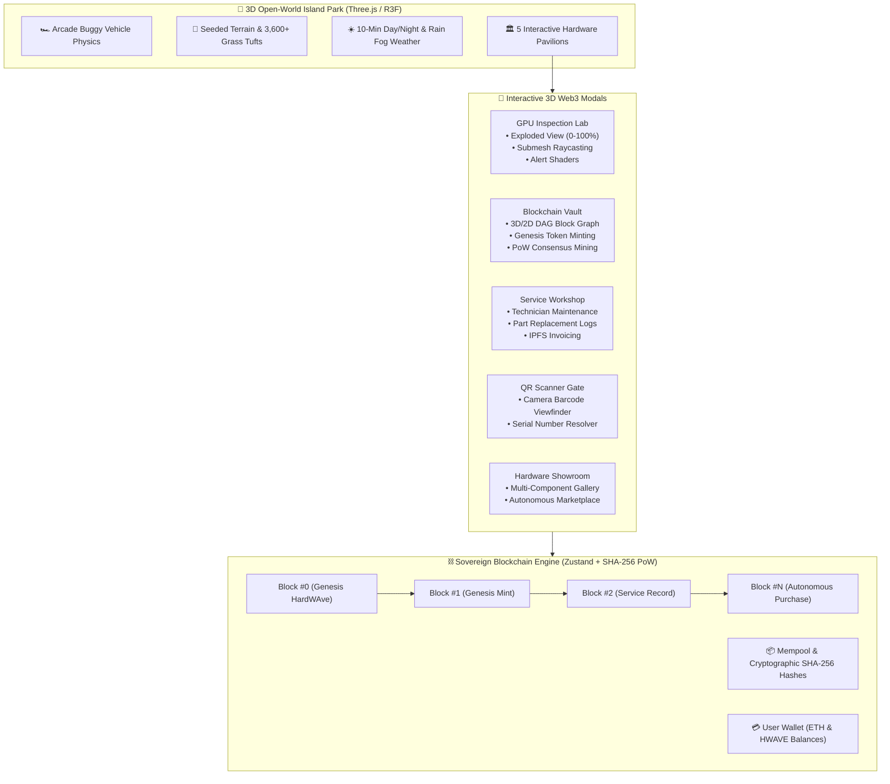

# HardWAve: System Architecture, Specification & Technical Manual

## Project Title
**HardWAve: Decentralized Hardware Authenticity, Warranty Provenance, Sovereign Blockchain Engine & 3D Interactive Open-World Platform**

---

## 1. Executive Summary & Core Objective

**HardWAve** is a Web3 Phygital & Digital Twin provenance ecosystem designed to eliminate counterfeit components, unauthorized aftermarket repairs, and warranty fraud in high-value electronic hardware (e.g. GPUs, Motherboards, SSDs, RAM modules, and Cooling systems).

The platform integrates:
1. An **Arcade Open-World 3D Nature Park** where users explore a living island with dynamic weather and day/night cycles in a customizable arcade buggy.
2. Five specialized **Hardware Exhibition Pavilions** that bridge physical device provenance with interactive browser-based 3D digital twins.
3. An **Interactive 3D Exploded Assembly Inspector** with dynamic shader alert states for repaired/replaced sub-components.
4. A **Sovereign In-Browser Blockchain Engine with Live 3D/2D DAG Block Graph Explorer** that computes authentic SHA-256 hashes, real Merkle roots and genuine proof-of-work nonces, then visually connects mined blocks in real time.
5. An **Autonomous Web3 Marketplace** allowing self-contained hardware purchases, wallet balance deduction, automated block mining, and verifiable on-chain ownership transfers.

---

## 2. System Architecture & Components



---

## 3. Core Functional Modules

### 3.1 🏎️ 3D Open-World Simulation & Physics Engine
* **Arcade Buggy Vehicle:** Smooth responsiveness with front-wheel steering, rear-wheel drive, spring-damped arcade acceleration, and collision bounding with terrain boundaries and park pavilions.
* **Dense Volumetric Meadow:** 3,600+ multi-blade crossed grass tufts (plus 450 wildflowers) anchored firmly at `h + 0.10m` above ground with zero clipping.
* **Deterministic Procedural Generation:** All scattered geometry — grass, flowers, clouds, leaves, pollen and rain — is placed by a seeded `mulberry32` PRNG (`src/utils/rng.ts`). The island is therefore identical across reloads, hot-reloads and Strict-Mode double renders, instead of reshuffling thousands of instances on every re-render.
* **Living Day/Night & Weather:** 10-minute full daylight cycle (Dawn, Noon, Sunset, Twilight, Deep Midnight) with dynamic directional lighting, starry sky dome, and toggleable rainstorms featuring 1,800+ rain streaks and dense misty fog.
* **Adaptive 2-Channel Audio Engine:**
  * **Music (BGM):** *Lanterns Over Fernvale* OST.
  * **SFX (Engine & Nature):** Velocity-modulated buggy drive sound (`drive.mp3`) that automatically pauses when stopped, crossfaded with ambient rainstorm sound (`rainy.mp3`).

### 3.2 🔬 3D Exploded Assembly & Dynamic Shader Alerts
* **Sub-Mesh Raycasting:** Identifies sub-components including Aluminum Backplate, PCB Motherboard, GA102 Silicon Die, 24GB GDDR6X VRAM modules, 18-Phase VRM power stages, Copper Heatpipe array, and Triple Cooling Fans.
* **Shader Alert State:** Original factory components render in metallic slate finishes; replaced or unverified aftermarket parts render in an **amber/red pulsating emissive glow** with direct links to the servicing technician's on-chain log.
* **Explosion Factor Slider (0–100%):** Smooth manual separation of layers along the Z-axis for complete internal inspection.

### 3.3 🌐 Sovereign Blockchain Engine & Interactive DAG Graph
* **Genuine SHA-256:** Digests come from `viem`'s `sha256` (audited `@noble/hashes`), not a placeholder hash function.
* **Real Merkle Trees:** `computeMerkleRoot` folds transaction hashes pairwise, duplicating a lone trailing node, matching Bitcoin's construction.
* **Real Proof-of-Work:** `mineHeader` increments a nonce until the header digest opens with `POW_DIFFICULTY` (4) zero nibbles — a ~65k-hash search, typically under a second, bounded by a 1M-iteration safety cap.
* **Tamper Detection:** `verifyChain` re-derives every Merkle root and header hash and validates each `previousHash` link, surfacing a live verified/tampered badge in the explorer.
* **Cryptographic Block Data Structure:**
  ```typescript
  interface Block {
    blockNumber: number;
    hash: string;         // SHA-256 (0x0000...)
    previousHash: string; // Parent block link
    merkleRoot: string;   // Transaction Merkle Root
    nonce: number;        // Proof-of-Work nonce
    timestamp: number;
    miner: string;        // Validator / Miner address
    gasUsed: number;
    transactions: Transaction[];
  }
  ```
* **Interactive Cyber Node Graph:** Two synchronized views of the same chain — an orbitable **3D** helix of colour-coded block cubes joined by animated hash-pointer lasers, and a compact **2D** chain-flow strip. Clicking any node inspects its raw header, nonce, gas and transaction payloads. The 3D camera re-frames itself automatically as the chain grows.
* **Consensus Simulation:** Dedicated "Mine Consensus Block" button to stress-test real-time block generation.

### 3.4 🛒 Autonomous Hardware Marketplace & Token Economics
* **Virtual Web3 Wallet:** Pre-funded user wallet (`8.50 ETH` and `420 HWAVE`), persisted via `zustand/persist`.
* **Direct 1-Click Purchase:** Deducts purchase price in ETH, credits `HWAVE` loyalty tokens at 100 per ETH spent, writes a `PURCHASE` transaction into the next mined block, updates the token's on-chain ownership to the buyer's wallet, and adds the device to the user's permanent hardware inventory.
* **Warranty Certificates:** Coverage is derived from each token's mint date and warranty term rather than hard-coded, so the showroom reports real months remaining and an accurate expiry date.
* **Pricing Index:**
  * NVIDIA RTX 3090 Founders Edition: `0.45 ETH`
  * NZXT Z490 Motherboard: `0.08 ETH`
  * Samsung 980 PRO PCIe 4.0 NVMe SSD: `0.06 ETH`
  * Kingston HyperX Fury DDR4 RAM: `0.03 ETH`
  * RGB High-Airflow Cooling Fan: `0.015 ETH`

---

## 4. User Interaction Workflows

1. **Autonomous Purchase Flow (Zero Physical Barrier):**
   * User navigates to the **GPU Lab** or **Hardware Showroom**.
   * User presses **`E`** to open the modal.
   * User clicks **"Purchase & Claim NFT"**.
   * Transaction executes, a new block is mined on the DAG graph, and ownership is updated instantly.

2. **Physical Barcode / QR Flow:**
   * User visits the **QR Scanner Gate**.
   * The live `getUserMedia` viewfinder opens and, where the browser exposes `BarcodeDetector`, decodes QR / Code 128 / Code 39 / EAN-13 / Data Matrix at 2.5 Hz.
   * Camera denied or unsupported? The manual resolver accepts a serial such as `HW-RTX3090-88421` (case-insensitive).
   * App resolves the token and launches the 3D Exploded View with full repair history.

3. **Technician Service Logging Flow:**
   * Technician visits the **Service Workshop**.
   * Enters component replacement notes (e.g. Center Cooling Fan replaced with OEM assembly) and the service cost.
   * A CIDv0-shaped attestation hash is derived from a real SHA-256 digest of the report payload, the record is appended to the token, and a `SERVICE` block is mined onto the sovereign chain.
   * The GPU inspector immediately renders that sub-component in its pulsing amber alert state.

---

## 5. Technology Stack Summary

* **Frontend:** Next.js 16 (Turbopack, App Router, TypeScript), Tailwind CSS v4, Lucide Icons.
* **3D Engine:** Three.js, React Three Fiber (`@react-three/fiber`), Drei (`@react-three/drei`), Postprocessing.
* **Cryptography:** `viem` — SHA-256 digests and hex encoding for the sovereign chain.
* **State & Persistence:** Zustand with local-storage persistence (`hardwave-hardware-registry`, `hardwave-blockchain-engine`).
* **Smart Contracts (EVM):** Solidity `0.8.24`, OpenZeppelin Contracts (`ERC-721`, `AccessControl`), Hardhat, Ethers v6.
* **Containerization:** Docker, Docker Compose (`hardwave_frontend`, `hardwave_blockchain`, `hardwave_postgres`).

---

## 6. Performance Architecture

The world runs at 60 fps by keeping React out of the render loop.

* **Telemetry split (`src/store/worldTelemetry.ts`):** the buggy's transform is written every frame to a plain mutable object read inside `useFrame`, and mirrored into a Zustand store only at ~10 Hz for the DOM HUD. Previously the position was React state updated 60 times a second, which re-rendered the entire page — canvas, HUD and navbar — on every frame.
* **Throttled day/night clock:** the 10-minute cycle advances on a 250 ms interval rather than `requestAnimationFrame`. Over a 600 s cycle the sun moves 0.6° per tick, below the perceptual threshold, for roughly 1/15th of the React work.
* **Memoized static world:** terrain, horizon islands, the Grand Oak, the meadow, props and pavilions are memoized against the lamp-brightness bucket, so clock ticks never rebuild them.
* **Proximity in the frame loop:** pavilion trigger zones are evaluated against the mutable telemetry mirror inside `useFrame`, replacing side effects that previously ran during render.
* **Lazy audio:** every track is created with `preload="none"`, so the multi-megabyte BGM file is no longer downloaded on first paint for visitors who never enable sound.
* **Adaptive resolution:** `<AdaptiveDpr />` lowers pixel density instead of dropping frames when the GPU is under pressure.
* **Precomputed genesis proof-of-work:** the three genesis nonces are baked in, keeping ~1 s of hashing off the start-up path while remaining self-healing if the genesis payload ever changes.