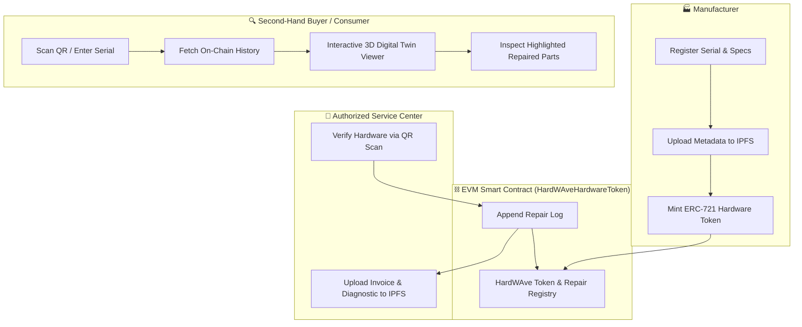

<div align="center">

# ⚡ HardWAve

**Decentralized Hardware Authenticity, Warranty Provenance & 3D Interactive Inspection System**

[](https://opensource.org/licenses/MIT)
[](https://nextjs.org/)
[](https://threejs.org/)
[](https://soliditylang.org/)
[](https://hardhat.org/)
[](https://tailwindcss.com/)

An end-to-end Web3 provenance platform that eliminates counterfeit electronic components and unauthorized aftermarket repairs in high-value hardware (such as GPUs, motherboards, SSDs, and laptops).

[Features](#-key-features) • [Architecture](#-architecture) • [Tech Stack](#-tech-stack) • [Quickstart](#-quickstart) • [3D Asset Setup](#-3d-model-assets)

---

</div>

## 🌟 Key Features

- **🌐 Interactive 3D Digital Twins:** Inspect hardware in real-time using Three.js & React Three Fiber. Rotate, zoom, and explode components into sub-meshes (Cooling Fans, Shroud, Heatsink, VRM, VRAM, and PCB).
- **🔒 On-Chain Hardware Provenance (ERC-721):** Every physical device is tied to an immutable token minted by authorized manufacturers containing factory specs and serial numbers.
- **🛠️ Role-Based Service & Repair Registry:** Authorized service centers append tamper-proof repair logs with cryptographic signatures and IPFS diagnostic evidence hashes.
- **🎨 Dynamic Shader Alerts:** Sub-components with pristine factory status render in neutral/metallic finishes, while replaced or repaired parts glow in amber/red alert states.
- **📱 QR & Barcode Hardware Scanner:** Instant scanning of serial barcodes on physical device chassis routing straight to the corresponding 3D digital twin.

---

## 🏛️ Architecture



---

## 💻 Tech Stack

| Layer | Technology |
| :--- | :--- |
| **Blockchain** | Solidity `^0.8.24`, Hardhat, OpenZeppelin Contracts (`ERC721URIStorage`, `AccessControl`, `Pausable`) |
| **Frontend Framework** | Next.js (App Router, TypeScript), Tailwind CSS, Lucide Icons |
| **3D Graphics Engine** | Three.js, React Three Fiber (`@react-three/fiber`), Drei (`@react-three/drei`) |
| **Web3 Client** | Wagmi, Viem, Ethers.js v6 |
| **Decentralized Storage** | IPFS (Pinata SDK) |

---

## 📁 Repository Structure

```text
HardWAve/
├── contracts/                  # Blockchain Layer (Hardhat & Solidity)
│   ├── contracts/
│   │   └── HardWAveHardwareToken.sol  # ERC-721 Token + Role-Based Repair Registry
│   ├── scripts/
│   │   └── deploy.ts           # Smart contract deployment script
│   ├── test/
│   │   └── HardWAveToken.test.ts # Hardhat unit tests
│   └── hardhat.config.ts       # Hardhat configuration (Cancun EVM, Sepolia / Amoy)
│
├── frontend/                   # Frontend Web App & 3D Viewer (Next.js)
│   ├── public/
│   │   └── models/             # 3D GLB/GLTF assets for interactive viewer
│   ├── src/
│   │   ├── app/
│   │   │   ├── page.tsx        # Splash Landing Page with 3D Looping Hero
│   │   │   ├── layout.tsx
│   │   │   └── globals.css
│   │   ├── components/
│   │   │   ├── 3d/
│   │   │   │   └── HeroHardwareCanvas.tsx # Three.js Looping Canvas
│   │   │   └── ui/
│   │   │       └── Navbar.tsx  # Web3 Cyberpunk Navbar
│   └── package.json
│
├── Assets/
│   └── 3D/                     # Raw 3D assets & reference documentation
├── HardWAve.md                 # System Specification & Architecture Document
├── package.json                # Root workspace commands
└── README.md
```

---

## 🚀 Quickstart

### Prerequisites
- **Node.js**: `v20.x` or `v22.x`
- **npm** or **yarn** / **pnpm**

### 1. Clone the Repository
```bash
git clone https://github.com/MrWilsonA/HardWAve.git
cd HardWAve
```

### 2. Install Dependencies
```bash
# Install root, frontend, and contracts dependencies
npm install --prefix contracts
npm install --prefix frontend
```

### 3. Run Smart Contract Tests
```bash
npm run test:contracts
```

### 4. Run Frontend Development Server
```bash
npm run dev
```
Open [http://localhost:3000](http://localhost:3000) in your browser to view the interactive 3D splash page.

---

## 🎨 3D Model Assets

The 3D viewer supports `.glb` and `.gltf` hardware models. Default models are mapped in `frontend/public/models/`:
- `gpu.glb` — Graphics Card (e.g. Nvidia RTX 3090)
- `fan.glb` — Animated RGB Cooling Fan
- `ssd.glb` — M.2 NVMe SSD
- `motherboard.glb` — Mainboard (e.g. NZXT N7 Z490)
- `ram.glb` — RAM Module (e.g. HyperX Fury)

---

## 📄 License

This project is licensed under the [MIT License](LICENSE).