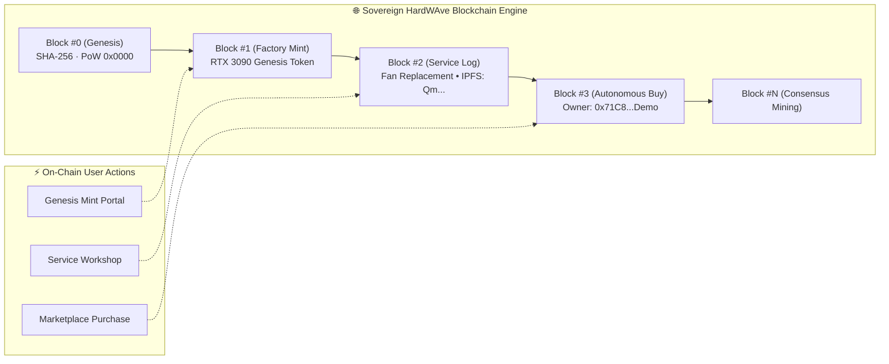

<div align="center">

# ⚡ HardWAve

**Decentralized Hardware Authenticity, Autonomous Blockchain & 3D Interactive Open-World Provenance System**

[](https://opensource.org/licenses/MIT)
[](https://nextjs.org/)
[](https://threejs.org/)
[](https://soliditylang.org/)
[](https://www.docker.com/)
[](https://tailwindcss.com/)

An end-to-end Web3 provenance and digital twin ecosystem that combines an **arcade buggy driving open-world**, an **interactive 3D exploded hardware inspector**, an **autonomous sovereign blockchain engine with live DAG graph visualization**, and a **self-contained hardware NFT marketplace**.

[Features](#-key-features) • [Open-World Park](#-open-world-park--stations) • [Blockchain Architecture](#-blockchain-architecture--dag-graph) • [Tech Stack](#-tech-stack) • [Quickstart & Docker](#-quickstart--docker) • [Controls](#-controls--navigation)

---

</div>

## 🌟 Key Features

### 1. 🏎️ 3D Open-World Island & Arcade Buggy Simulation
* **Interactive Exploration:** Drive a red buggy across an aesthetic nature island featuring a Grand Oak World Tree centerpiece, central rotary, stone bridges, and 3,600+ dense volumetric grass tufts.
* **Living Dynamic World:** 10-minute real-time day/night lighting cycle, atmospheric rain storms with dense volumetric fog, and particle ripples.
* **Deterministic Worldgen:** Every tuft, tree, cloud and rain streak is placed by a seeded PRNG, so the island is byte-identical on every load while staying visually varied.
* **Smooth Adaptive Audio:** Dual-channel audio system with velocity-modulated engine acceleration (`drive.mp3`), rainstorm ambient crossfade (`rainy.mp3`), and isekai exploration OST.

### 2. 🔬 Interactive 3D Exploded Hardware Inspection (Digital Twin)
* **Exploded Assembly Slider (0–100%):** Smoothly expand hardware models (e.g. RTX 3090) into isolated sub-components (Backplate, PCB, GA102 Silicon Die, 24GB GDDR6X VRAM, 18-Phase VRM, Copper Heatpipes, Triple Axial Fans, and Outer Shroud). The armor shroud dissolves to glass as the assembly opens so the internals stay visible.
* **Dynamic Shader Alert System:** Original factory parts render in sleek metallic finishes, while repaired/aftermarket parts (e.g., replaced cooling fans) pulse in an amber/red emissive alert state driven directly by the token's on-chain repair records.
* **Component Raycasting:** Click any 3D submesh to view instant on-chain diagnostic history and IPFS attestation hashes.
* **Three Inspection Modes:** *3D Exploded Twin*, a full *On-Chain Lifecycle Timeline*, and the *IPFS Attestation* ledger of pinned evidence.

### 3. 🌐 Sovereign Blockchain Engine & Live DAG Graph Explorer
* **Real Cryptography:** Every block header is hashed with genuine **SHA-256** (via `viem`/`@noble`), every block carries a **Merkle root** folded pairwise over its transaction hashes, and every block is sealed by an actual **proof-of-work nonce search** against a `0x0000` difficulty target.
* **Chain Verification:** The explorer re-derives every hash and Merkle root on the fly and displays a live `SHA-256 VERIFIED` badge — or flags the exact block number if persisted state was tampered with.
* **Visual 3D & 2D Blockchain Node Graph:** Toggle between an orbitable 3D helix of block nodes joined by animated hash-pointer lasers, and a compact 2D chain-flow view. Click any block (`#0 Genesis`, `#1 Mint`, `#2 Service`, `#N Purchase`) to inspect raw headers and transaction payloads.
* **Consensus Mining:** Mine new blocks on-demand or trigger automatic block creation when transactions execute.

### 4. 🛒 Autonomous Hardware Marketplace & Ownership Transfer
* **Self-Contained Economy:** Purchase tokenized hardware (RTX 3090, NZXT Motherboard, Samsung SSD, Kingston RAM, RGB Fan) using virtual wallet funds. Spending ETH earns `HWAVE` loyalty tokens at 100 HWAVE per ETH.
* **Instant On-Chain Transfer:** Deducts balance, mines a new proof-of-work block on the sovereign chain, and transfers ERC-721 ownership directly to the buyer's wallet.
* **My Hardware Inventory:** A dedicated inventory view tracking certified ownership badges and live warranty certificates computed from each token's mint date.

### 5. 📱 QR & Barcode Hardware Scanner
* **Real webcam viewfinder** via `getUserMedia`, with live barcode decoding through the browser's `BarcodeDetector` API where available (QR, Code 128, Code 39, EAN-13, Data Matrix).
* Graceful degradation: if the camera is denied or the browser has no decoder, the manual serial resolver stays fully functional and routes any registered serial straight to its 3D digital twin.

---

## 🏛️ Open-World Park & Stations

| Station | Location | Model | Interactive Experience |
| :--- | :--- | :--- | :--- |
| **GPU Inspection Lab** | `[-16, -16]` (SW) | RTX 3090 | 3D Exploded Assembly, Sub-mesh Diagnostics, Alert Shaders |
| **Blockchain Vault** | `[20, -16]` (SE) | Samsung 980 SSD | Live 3D/2D DAG Block Graph Explorer, Genesis Minting Portal |
| **Service Workshop** | `[-18, 18]` (NW) | RGB Cooling Fan | Authorized Technician Maintenance Logger & IPFS Proofs |
| **QR Scanner Gate** | `[0, -25]` (South Gate) | Kingston RAM | Live Webcam & Barcode Scanner, Serial Resolver |
| **Hardware Showroom** | `[22, 18]` (NE) | NZXT Z490 Board | Multi-Component Hardware Gallery & Marketplace Kiosk |

---

## ⛓️ Blockchain Architecture & DAG Graph



Each block header is serialized as
`blockNumber | previousHash | merkleRoot | timestamp | miner | gasUsed | nonce`
and hashed with SHA-256. Mining increments the nonce until the digest opens with
four zero nibbles. The three genesis blocks use precomputed nonces so start-up
stays instant; any edit to their content simply re-mines them on the spot.

---

## 💻 Tech Stack

| Layer | Technology |
| :--- | :--- |
| **Frontend Framework** | Next.js 16 (App Router, Turbopack, TypeScript), Tailwind CSS v4 |
| **3D Graphics & Physics Engine** | Three.js, React Three Fiber (`@react-three/fiber`), Drei, Postprocessing |
| **State & Blockchain Engine** | Zustand (`zustand/persist`), custom SHA-256 proof-of-work chain |
| **Cryptography** | `viem` (SHA-256 digests, hex encoding) |
| **Smart Contracts** | Solidity `^0.8.24`, Hardhat, Ethers v6, OpenZeppelin (`ERC-721`, `AccessControl`) |
| **Containerization** | Docker, Docker Compose, Alpine Linux |
| **Decentralized Storage** | IPFS-style CIDv0 attestations derived from SHA-256 content digests |

---

## 🚀 Quickstart & Docker

### Option A: Running via Docker Compose (Recommended)

```bash
# Clone repository
git clone https://github.com/MrWilsonA/HardWAve.git
cd HardWAve

# Start the full stack (Frontend, Blockchain Node, PostgreSQL)
docker compose up --build -d
```

> 🌐 Open **[http://localhost:3001](http://localhost:3001)** in your browser.

### Option B: Local Node.js Development

```bash
# 1. Install dependencies
cd frontend
npm install

# 2. Start Next.js development server
npm run dev
```

> 🌐 Open **[http://localhost:3000](http://localhost:3000)** in your browser.

### Quality gates

```bash
cd frontend
npx tsc --noEmit   # type check
npx eslint src     # lint
npm run build      # production build
```

---

## 🎮 Controls & Navigation

| Action | Control Key | Description |
| :--- | :--- | :--- |
| **Drive Forward** | `W` / `↑` | Accelerates the buggy forward with adaptive audio |
| **Steer Left / Right** | `A` / `D` / `←` `→` | Turns wheels with smooth arcade steering |
| **Reverse / Brake** | `S` / `↓` | Applies brake and engages reverse gear |
| **Handbrake** | `Space` | Hard stop |
| **Inspect Station** | `E` / Click Banner | Opens interactive modal when inside a pavilion zone |
| **Close Modal** | `Esc` / Click Outside | Dismisses any open pavilion experience |
| **Rotate Camera** | `Left Click + Drag` | 360° Orbit inspection around vehicle or hardware |
| **Zoom Camera** | `Scroll Wheel` | Zoom in / out |
| **Fast Travel** | `Compass Icon` (HUD) | Instant GPS teleportation to any of the 5 pavilions |
| **Weather Mode** | `Cloud Icon` (HUD) | 1-Click toggle between Sunny Skies and Dynamic Rain |

Driving input is suspended while a pavilion modal is open, and typing in any form field never steers the buggy.

---

## 📜 License

Distributed under the **MIT License**. See [`LICENSE`](LICENSE) for more information.
